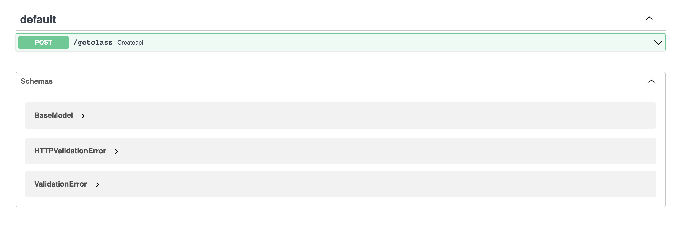

# FastMlOps
esay to deploy your ml model 

## example
```python
from FastMlOps import FastMlOps

app = FastML()

config = {
    "method" : "POST" ,
    "path" : "/getclass" ,
    "inputModel" : {
        "x" : int,
        "y" : int
    } , 
    "responseModel" : {
        "catagory" : str ,
        "confidence" : float
    },
    "model" : "model1.h5"
}

app.createAPI(config)
```
- **method** : use for http method ex. **GET** , **POST**
- **path** : url path for test server
- **inputModel** : input of your ml model
- **responseModel** : output of your ml model
- **model** : path to your ml model ex. **"/path/ml.h5"**

connect to 
```
http://localhost:8000/docs#/
```


enjoy for ez API